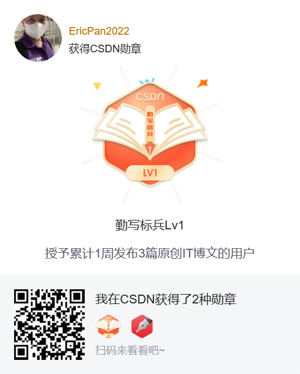

# dev-note


iOS/web/server dev notes, should be daily

# install homebrew 
```
/usr/bin/ruby -e "$(curl -fsSL https://raw.githubusercontent.com/Homebrew/install/master/install)"
```

# install iterm2 
```
brew cask install iterm2
```
# install zsh 
```
sh -c "$(curl -fsSL https://raw.github.com/robbyrussell/oh-my-zsh/master/tools/install.sh)"
```
# install  Powerlevel9k theme
```
git clone https://github.com/bhilburn/powerlevel9k.git ~/.oh-my-zsh/custom/themes/powerlevel9k
```

# install fonts 
url: https://github.com/powerline/fonts/blob/master/Meslo%20Slashed/Meslo%20LG%20M%20Regular%20for%20Powerline.ttf

other power line fonts 
https://github.com/powerline/fonts

# ZHS change terminal username 
add below func at very end of .zshrc

```
prompt_context() {
  if [[ "$USER" != "$DEFAULT_USER" || -n "$SSH_CLIENT" ]]; then
    prompt_segment black default "%(!.%.)$USER"
  fi
}
```
## Or 
```
echo "DEFAULT_USER=\"your name\"" >> ~/.zshrc && source ~/.zshrc
```

# vi command 
- G : jump to end of file
- gg or 1G : jump to beginning of file

# URLs
https://portal.shadowsocks.la/

# AI text to Image

 


